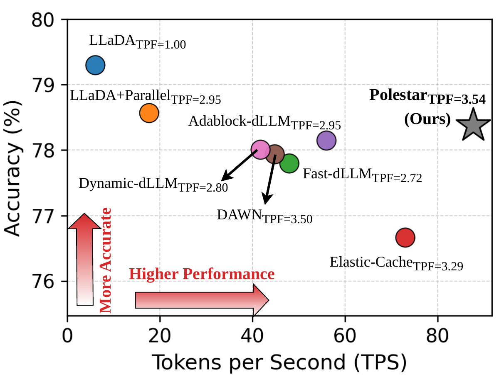
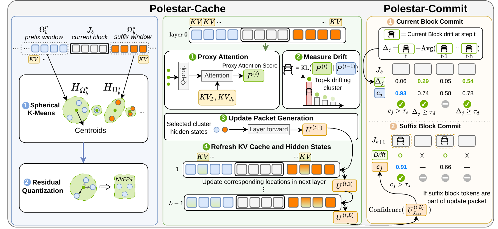

<div align="center">

# Polestar

### Drift-Aware Cache Calibration and Token Commitment for Efficient Inference of Diffusion LLMs

**Official implementation · NeurIPS 2026**

Mingyu Lee\*, Akshat Ramachandran\*, Souvik Kundu, and Tushar Krishna<br>
Georgia Institute of Technology · Intel AI Group<br>
\* Equal contribution

[Paper](https://arxiv.org/pdf/2607.14107) · [Quickstart](#quickstart) · [Models](#models-and-examples) · [Evaluation](docs/evaluation.md) · [Method](docs/method.md)

</div>

**Polestar is a training-free inference framework that uses representation drift as a shared signal for sparse KV-cache calibration and early token commitment in diffusion LLMs.**

Across the paper's mathematics and coding benchmarks, Polestar achieves **up to 3.7× higher throughput** and **up to 10.73% accuracy improvement** over existing baselines, with decoding parallelism reaching **3.67 tokens per forward pass**.

<p align="center">
  
</p>

*Accuracy–throughput trade-off on GSM8K with LLaDA-8B-Instruct, reproduced from Figure 1 of the paper. TPF denotes tokens per forward pass.*

## Quickstart

Use Python 3.10 or newer and a CUDA-capable NVIDIA GPU. Install Polestar from source:

```bash
git clone https://github.com/gt-synergy-lab/Polestar.git
cd Polestar
python -m pip install -e .
```

Generate a response with LLaDA-8B-Instruct:

```bash
python examples/generate.py --config configs/llada8b.json \
  --prompt "Natalia sold 48 clips in April and half as many in May. How many did she sell altogether?"
```

The example prints the generated response and the number of model evaluations. The checkpoint and tokenizer are loaded from Hugging Face and cached locally. A local checkpoint directory can also be used as `model_id` in the preset.

For installation details, see [Installation](docs/installation.md).

## Models and examples

| Model | Preset | Generate |
|---|---|---|
| LLaDA-8B-Instruct | [llada8b.json](configs/llada8b.json) | `python examples/generate.py --config configs/llada8b.json` |
| LLaDA-1.5 | [llada15.json](configs/llada15.json) | `python examples/generate.py --config configs/llada15.json` |
| Dream-7B-Instruct | [dream7b.json](configs/dream7b.json) | `python examples/generate.py --config configs/dream7b.json` |
| LLaDA-V | [llada-v.json](configs/llada-v.json) | `python examples/image_generation.py --image path/to/image.jpg --prompt "Describe this image."` |

Install image-generation dependencies with `python -m pip install -e '.[vision]'` before running LLaDA-V. Examples generate one response at a time. See [Model guide](docs/models.md) for checkpoint and input details.

You can also use Polestar from Python:

```python
from polestar import PolestarConfig, generate, load_model

config = PolestarConfig.from_json("configs/dream7b.json")
model, tokenizer = load_model(config)
result = generate(model, tokenizer, "Explain bidirectional attention.", config)
print(result.text)
```

## How Polestar works

- **Polestar-Cache** uses drift in centroid proxy attention to identify active regions of contextual adaptation and selectively refresh cached hidden states and KV entries.
- **Polestar-Commit** uses recent-history-relative drift events and prediction confidence to identify tokens ready for commitment.
- **Local, sparse updates** align cached representations with newly decoded context while preserving fixed-block generation.

<p align="center">
  
</p>

*Polestar methodology, reproduced from Figure 5 of the paper.*

See [Method](docs/method.md) for the implementation map to Algorithm 1.

## Evaluation

Install the text evaluation dependencies and run a benchmark:

```bash
python -m pip install -e '.[eval]'
python evaluation/run.py --config configs/llada8b.json --task gsm8k \
  --output-path results/llada8b-gsm8k-256
```

The evaluation presets specify few-shot counts and generation settings. [Evaluation](docs/evaluation.md) covers GSM8K, MATH, HumanEval, MBPP, MathVista, and MathVerse, including code postprocessing and result files.

## News

- **October 2026:** Polestar accepted at NeurIPS 2026. Algorithm code released for LLaDA, Dream, and LLaDA-V.

## Citation

```bibtex
@misc{lee2026polestar,
  title={Polestar: Drift-Aware Cache Calibration and Token Commitment for Efficient Inference of Diffusion LLMs},
  author={Mingyu Lee and Akshat Ramachandran and Souvik Kundu and Tushar Krishna},
  year={2026},
  eprint={2607.14107},
  archivePrefix={arXiv},
  primaryClass={cs.CL},
  url={https://arxiv.org/abs/2607.14107}
}
```

## License

Polestar's original code is provided under the [MIT License](LICENSE). Bundled model implementations retain their original copyright notices and licenses; see [Third-party notices](THIRD_PARTY_NOTICES.md).
