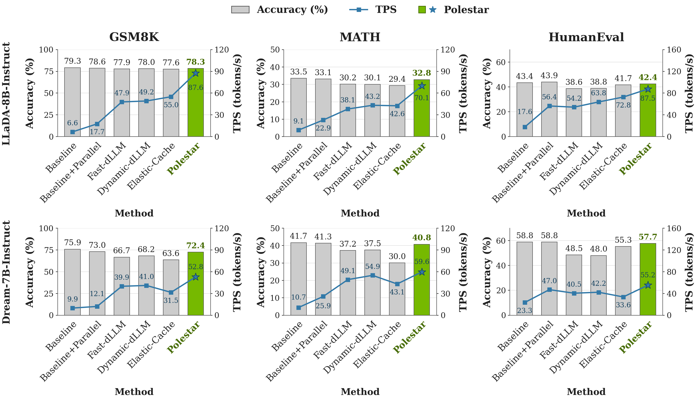

<div align="center">

# Polestar

### Drift-Aware Cache Calibration and Token Commitment for Efficient Inference of Diffusion LLMs

**Official implementation · NeurIPS 2026**

[](https://arxiv.org/abs/2607.14107)
[](https://arxiv.org/pdf/2607.14107)
[](https://github.com/gt-synergy-lab/Polestar/actions/workflows/checks.yml)
[](LICENSE)

Mingyu Lee\*, Akshat Ramachandran\*, Souvik Kundu, and Tushar Krishna<br>
Georgia Institute of Technology · Intel AI Group<br>
\* Equal contribution

**[Paper](https://arxiv.org/pdf/2607.14107) · [Results](#performance) · [Quickstart](#quickstart) · [Models](#models-and-examples) · [Evaluation](docs/evaluation.md) · [Method](docs/method.md)**

</div>

## News

- **October 2026:** Algorithm code released for LLaDA, Dream, and LLaDA-V.
- **September 2026:** Polestar accepted at **NeurIPS 2026**.

## Method Overview

**Polestar is a training-free inference framework that uses representation drift as a shared signal for sparse KV-cache calibration and early token commitment in diffusion LLMs.**

- **Refresh where it matters.** Polestar-Cache locates high-drift regions and selectively updates cached representations.
- **Commit when tokens are ready.** Polestar-Commit combines drift events with confidence to increase decoding parallelism.
- **Use existing checkpoints.** Run LLaDA-8B-Instruct, LLaDA-1.5, Dream-7B-Instruct, and LLaDA-V without additional training.

<p align="center">
  
</p>

<p align="center"><em>Polestar-Cache and Polestar-Commit.</em> <a href="docs/method.md">Method</a></p>

## Performance

Across the paper's mathematics and coding benchmarks, Polestar achieves **up to 3.7× higher throughput** and **up to 10.73% accuracy improvement** over existing baselines, with decoding parallelism reaching **3.67 tokens per forward pass**.

<p align="center">
  <a href="assets/figures/accuracy-throughput.png"></a>
</p>

<p align="center"><em>Accuracy–throughput trade-off.</em></p>

<p align="center">
  <a href="assets/figures/table1-256.svg"></a>
</p>

<p align="center"><em>Accuracy and throughput · 256 tokens.</em> <a href="assets/figures/table1-256.svg">Figure</a> · <a href="assets/data/table1.json">Data</a></p>

**Results across all four models:**

| Model | Benchmark | Accuracy (%) ↑ | TPF ↑ | TPS ↑ |
|---|---|---:|---:|---:|
| LLaDA-8B-Instruct | GSM8K · 5-shot | 78.33 | 3.67 | 87.57 |
| LLaDA-1.5 | GSM8K · 5-shot | 81.06 | 3.40 | 79.65 |
| Dream-7B-Instruct | GSM8K · 5-shot | 72.40 | 2.39 | 52.80 |
| LLaDA-V | MathVista | 63.58 | 2.17 | 37.91 |
| LLaDA-V | MathVerse | 36.12 | 2.85 | 42.95 |

<p align="center"><em>Paper results · NVIDIA A100 80GB · batch size 1 · text generation length 256.</em> <a href="docs/results.md">Full results and protocol</a></p>

## Quickstart

Use Python 3.10 or newer and a CUDA-capable NVIDIA GPU. Install Polestar from source:

```bash
git clone https://github.com/gt-synergy-lab/Polestar.git
cd Polestar
python -m pip install -e .
```

Generate a response with LLaDA-8B-Instruct:

```bash
python examples/generate.py --config configs/llada8b.json \
  --prompt "Natalia sold 48 clips in April and half as many in May. How many did she sell altogether?"
```

The example prints the generated response followed by `Model evaluations: ...`. The checkpoint and tokenizer are loaded from Hugging Face and cached locally. Use a local checkpoint directory as `model_id` in the preset to load your own copy.

For installation details, see [Installation](docs/installation.md).

## Models and examples

| Model | Input | Preset | Generate | Evaluate |
|---|---|---|---|---|
| LLaDA-8B-Instruct | Text | [llada8b.json](configs/llada8b.json) | [Text example](examples/generate.py) | [Text benchmarks](docs/evaluation.md#text-benchmarks) |
| LLaDA-1.5 | Text | [llada15.json](configs/llada15.json) | [Text example](examples/generate.py) | [Text benchmarks](docs/evaluation.md#text-benchmarks) |
| Dream-7B-Instruct | Text | [dream7b.json](configs/dream7b.json) | [Text example](examples/generate.py) | [Text benchmarks](docs/evaluation.md#text-benchmarks) |
| LLaDA-V | Image + text | [llada-v.json](configs/llada-v.json) | [Image example](examples/image_generation.py) | [Image benchmarks](docs/evaluation.md#image-benchmarks) |

Switch text models by replacing the `--config` path in the quickstart. For an image-conditioned response with LLaDA-V:

```bash
python -m pip install -e '.[vision]'
python examples/image_generation.py --config configs/llada-v.json \
  --image path/to/image.jpg --prompt "Describe this image."
```

See the [model guide](docs/models.md) for checkpoint, input, and generation settings.

<details>
<summary><b>Python API: load a preset and generate</b></summary>

```python
from polestar import PolestarConfig, generate, load_model

config = PolestarConfig.from_json("configs/dream7b.json")
model, tokenizer = load_model(config)
result = generate(model, tokenizer, "Explain bidirectional attention.", config)
print(result.text)
```

</details>

## Evaluation

Install the text evaluation dependencies and run a benchmark:

```bash
python -m pip install -e '.[eval]'
python evaluation/run.py --config configs/llada8b.json --task gsm8k \
  --output-path results/llada8b-gsm8k-256
```

Add `--limit 0.1` to run 10% of a benchmark, or `--limit 16` to run 16 examples. The evaluation presets specify few-shot counts and generation settings. [Evaluation](docs/evaluation.md) covers GSM8K, MATH, HumanEval, MBPP, MathVista, and MathVerse, including code postprocessing and result files.

## Documentation

| Guide | What you'll find |
|---|---|
| [Installation](docs/installation.md) | Dependencies, CUDA setup, and environment options |
| [Models](docs/models.md) | Checkpoints, text and image inputs, and generation presets |
| [Method](docs/method.md) | Polestar-Cache, Polestar-Commit, and the implementation of Algorithm 1 |
| [Evaluation](docs/evaluation.md) | Benchmark commands, task settings, scoring, and output files |
| [Paper results](docs/results.md) | Accuracy, TPF, TPS, and measurement definitions |

Questions and contributions are welcome through [issues](https://github.com/gt-synergy-lab/Polestar/issues) and [pull requests](https://github.com/gt-synergy-lab/Polestar/pulls).

## Citation

```bibtex
@misc{lee2026polestar,
  title={Polestar: Drift-Aware Cache Calibration and Token Commitment for Efficient Inference of Diffusion LLMs},
  author={Mingyu Lee and Akshat Ramachandran and Souvik Kundu and Tushar Krishna},
  year={2026},
  eprint={2607.14107},
  archivePrefix={arXiv},
  primaryClass={cs.CL},
  url={https://arxiv.org/abs/2607.14107}
}
```

## License

Polestar's original code is provided under the [MIT License](LICENSE). Bundled model implementations retain their original copyright notices and licenses; see [Third-party notices](THIRD_PARTY_NOTICES.md).
